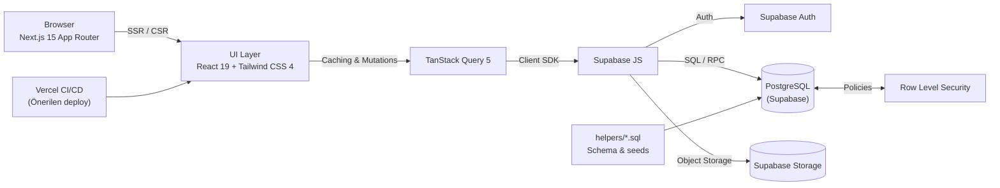
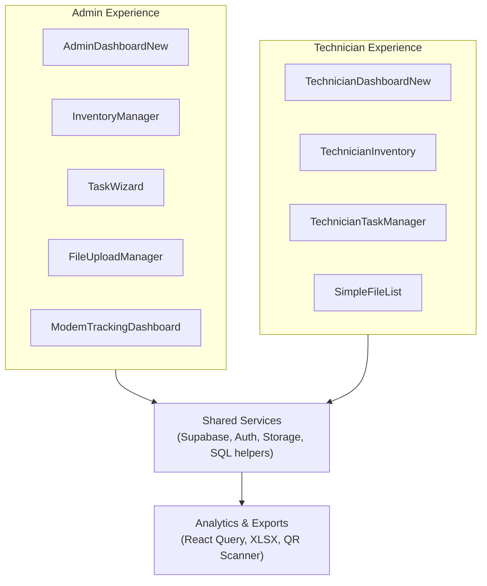

# Alp System Manager

> Field-ready technician operations suite built on Next.js 15, Supabase, and a real-time equipment-tracking pipeline.

<p align="center">
	
</p>

<p align="center">
	

</p>


## 🗂️ İçindekiler | Table of Contents

1. [🚀 Executive Snapshot | Proje Özeti](#-executive-snapshot--proje-özeti)
2. [🧭 Architecture Diagrams | Mimari Şemalar](#-architecture-diagrams--mimari-şemalar)
3. [🗃️ Repository Highlights | Depo Özeti](#️-repository-highlights--depo-özeti)
4. [🇹🇷 Türkçe Bölüm](#-türkçe-bölüm)
5. [🇬🇧 English Section](#-english-section)
6. [📄 License | Lisans](#-license--lisans)

## 🚀 Executive Snapshot | Proje Özeti

- 🇹🇷 Alp System Manager, saha ekibi operasyonlarını tek panelde toplayan; görev, envanter, modem takibi, dosya yönetimi ve performans ölçümlerini gerçek zamanlı yöneten modern bir SaaS temelidir.
- 🇬🇧 Alp System Manager is a production-ready platform that unifies field technician scheduling, inventory orchestration, modem tracking, secure file management, and performance analytics in real time.

## 🧭 Architecture Diagrams | Mimari Şemalar

<div align="center">



</div>

<div align="center">



</div>

> 🇹🇷 Diagramlar, istemci tarafı Next.js uygulamasının Supabase Auth / PostgreSQL / Storage servisleriyle etkileşimini ve yönetici-teknisyen modülleri arasındaki modüler ayrımı gösterir. <br/>
> 🇬🇧 The diagrams highlight how the Next.js client orchestrates Supabase Auth/PostgreSQL/Storage while keeping admin and technician domains modular.

## 🗃️ Repository Highlights | Depo Özeti

**Stack in production:** Next.js 15.5 App Router, React 19, TypeScript 5, TanStack Query 5, Tailwind CSS 4, Supabase (Auth · Postgres · Storage), React Hook Form + Zod, Lucide Icons, XLSX import, QR/Barcode scanner.

```text
src/
	app/                → Next.js (App Router) giriş noktaları & sayfa bileşenleri
	components/         → Admin ve teknisyen arayüzüne ait modüler bileşenler
	hooks/              → React Query & form mantığını kapsülleyen özel hook'lar
	lib/                → Supabase client, tipler ve yardımcı araçlar
helpers/              → Supabase şema/migrasyon SQL dosyaları
public/uploads/       → Dosya ve varlık örnekleri
```

---

## 🇹🇷 Türkçe Bölüm

### Genel Bakış

Alp System Manager, saha ekiplerinin tüm iş akışlarını dijitalleştiren kurumsal seviyede bir Next.js uygulamasıdır. Yönetici paneli, teknisyen atamaları, envanter paylaşımları, modem seri takibi, dosya yönetimi ve performans raporları tek çatı altında birleşir.

### Ana Özellikler

- **Görev Yönetimi:** Farklı görev tipleri, durum değişiklikleri ve görev notları için Task Wizard.
- **Envanter & Modem Takibi:** Seri numarasıyla akıllı ekipman tespiti, çoklu envanter ataması, iade & bakım akışları.
- **Dosya & Evrak Yönetimi:** Supabase Storage ile güvenli yükleme, indirme, sürüm takibi.
- **Teknisyen Portalı:** Kişisel görev, envanter ve dosya görünümü; profil güncellemeleri.
- **Excel & QR Destekleri:** XLSX tabanlı toplu içe aktarma, saha üzerinde QR/Barcode tarama.
- **Gerçek Zamanlılık:** Supabase subscriptions ve React Query cache ile canlı güncellemeler.

### Mimari ve Teknolojiler

- **Sunum Katmanı:** Next.js 15 App Router, React 19, Tailwind CSS 4.
- **Durum Yönetimi:** TanStack Query 5, React Hook Form 7 + Zod 4.
- **Arka Plan Servisleri:** Supabase Auth (email OTP / magic link), RLS korumalı PostgreSQL, Supabase Storage.
- **Veri Modeli:** `profiles`, `tasks`, `technician_files`, `inventory`, `equipment_tracking` ve log tabloları.
- **DevOps:** Vercel deploy uyumlu; lint/build komutları CI senaryolarına hazır.

### Veritabanı & Güvenlik

- `helpers/` klasöründeki SQL dosyaları üretim şemasını, seed verisini ve RLS politikalarını içerir.
- RLS ile admin ve teknisyen rolleri ayrıştırılır; servis rolleri yalnızca sunucu tarafında kullanılır.
- Denetim günlükleri (`_log` tabloları) ekipman değişikliklerini izler.

### Kurulum & Çalıştırma

```bash
# Bağımlılıkları yükle
npm install

# Yerel geliştirme
npm run dev

# Test amaçlı build
npm run build
```

`.env.local` dosyasında aşağıdaki anahtarları tanımlayın:

```bash
NEXT_PUBLIC_SUPABASE_URL=********
NEXT_PUBLIC_SUPABASE_ANON_KEY=********
SUPABASE_SERVICE_ROLE_KEY=********   # Sadece server-side kullanım, gizli tutun
```

Supabase SQL Editor'de ilgili tabloları oluşturmak için `helpers/setup-database.sql` ve ekipman takibi için `helpers/expand-to-equipment-tracking.sql` dosyalarını sırasıyla çalıştırın.

### Geliştirme Komutları

- `npm run dev` – Turbopack ile hızlı geliştirme sunucusu.
- `npm run build` – Production build (Vercel uyumlu).
- `npm run start` – Production build'i çalıştırır.
- `npm run lint` – ESLint (Next.js + TypeScript kuralları).

### CV'ye Yazılabilecek Katkılar

- Next.js 15 App Router ve React 19 ile modüler, çok rollü bir saha operasyon platformu tasarladım.
- Supabase PostgreSQL üzerinde RLS politikaları, servis role erişimleri ve audit log tasarımı kurdum.
- XLSX içe aktarma, QR/Barcode tarama ve toplu envanter atama gibi üretim senaryolarını destekledim.
- TanStack Query 5 ve React Hook Form + Zod ile tip güvenli formlar ve gerçek zamanlı cache katmanı geliştirdim.
- Vercel uyumlu CI/CD pipeline'ı, lint/build kontrolleri ve TypeScript strict moduyla kalite süreçlerini oturttum.

### İzleme & Yol Haritası

- Supabase Metrics ile Auth/SQL performans izleme.
- Yaklaşan fikirler: offline-first mobil destek, görev/rota optimizasyonu, Supabase Edge Functions ile webhook entegrasyonları.

---

## 🇬🇧 English Section

### Overview

Alp System Manager is an enterprise-grade field operations platform. It centralises technician scheduling, asset handovers, modem serial control, secure document workflows, and KPI dashboards inside a polished Next.js 15 experience.

### Key Features

- **Task Orchestration:** Multi-type task wizard with lifecycle controls and notes.
- **Inventory & Modem Tracking:** Smart serial detection, multi-assignment, returns, and maintenance workflows.
- **Document Control:** Secure uploads/downloads with Supabase Storage and audit trails.
- **Technician Workspace:** Personalised views for tasks, inventory, files, and profile updates.
- **Productivity Boosters:** XLSX batch imports, QR/barcode scanner for on-site operations.
- **Real-Time UX:** Supabase subscriptions and TanStack Query caching keep data live without reloads.

### Architecture & Stack

- **Presentation:** Next.js 15 App Router, React 19, Tailwind CSS 4.
- **State & Forms:** TanStack Query 5, React Hook Form 7, Zod 4.
- **Backend Services:** Supabase Auth, PostgreSQL with RLS, Supabase Storage buckets.
- **Data Model:** `profiles`, `tasks`, `technician_files`, `inventory`, `equipment_tracking`, plus history tables.
- **Operations:** Optimised for Vercel deployments with strict TypeScript and ESLint.

### Database & Security

- The `helpers/` folder contains reproducible SQL migrations, seeds, and RLS policy scripts.
- Role separation is enforced through Supabase RLS; the service role key is consumed only on the server.
- Equipment movements are captured through dedicated log tables to maintain traceability.

### Getting Started

```bash
# Install dependencies
npm install

# Start local development
npm run dev

# Create a production build
npm run build
```

Create `.env.local` with:

```bash
NEXT_PUBLIC_SUPABASE_URL=********
NEXT_PUBLIC_SUPABASE_ANON_KEY=********
SUPABASE_SERVICE_ROLE_KEY=********   # Keep server-side only
```

Apply the schema using Supabase SQL Editor: start with `helpers/setup-database.sql`, then extend with `helpers/expand-to-equipment-tracking.sql` and other migration files as needed for modem/equipment flows.

### Developer Tooling

- `npm run dev` – Turbopack dev server for lightning-fast HMR.
- `npm run build` – Production-ready bundles (SSR + edge friendly).
- `npm run start` – Runs the compiled build.
- `npm run lint` – Next.js ESLint rules for TS/React best practices.

### Resume Highlights

- Architected a dual-role (admin & technician) platform on Next.js 15 with modular dashboards and shared services.
- Implemented Supabase-backed RLS, service-role gated server utilities, and immutable audit logging for equipment tracking.
- Delivered productivity tooling including XLSX ingestion, QR/barcode scanning, and bulk inventory assignment flows.
- Established type-safe forms and optimistic UI patterns with TanStack Query, React Hook Form, and Zod.
- Hardened delivery with Vercel-friendly CI/CD, strict TypeScript, and lint automation.

### Roadmap & Ideas

- Observability through Supabase Metrics dashboards and custom logs.
- Upcoming concepts: offline-first technician mode, route optimisation, and Supabase Edge Functions for external integrations.

---

## 📄 License | Lisans

MIT License · Özgürce kullanın, geliştirin ve paylaşın.
